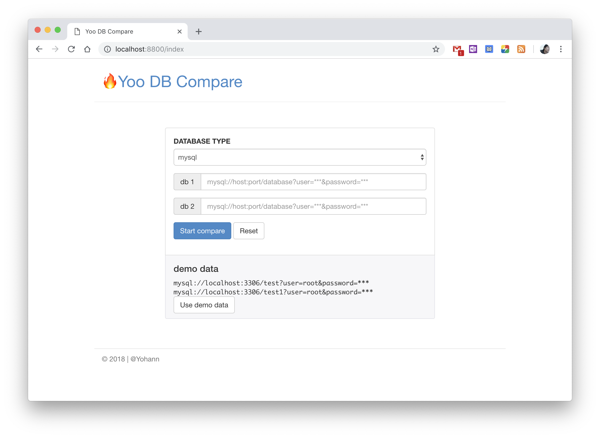
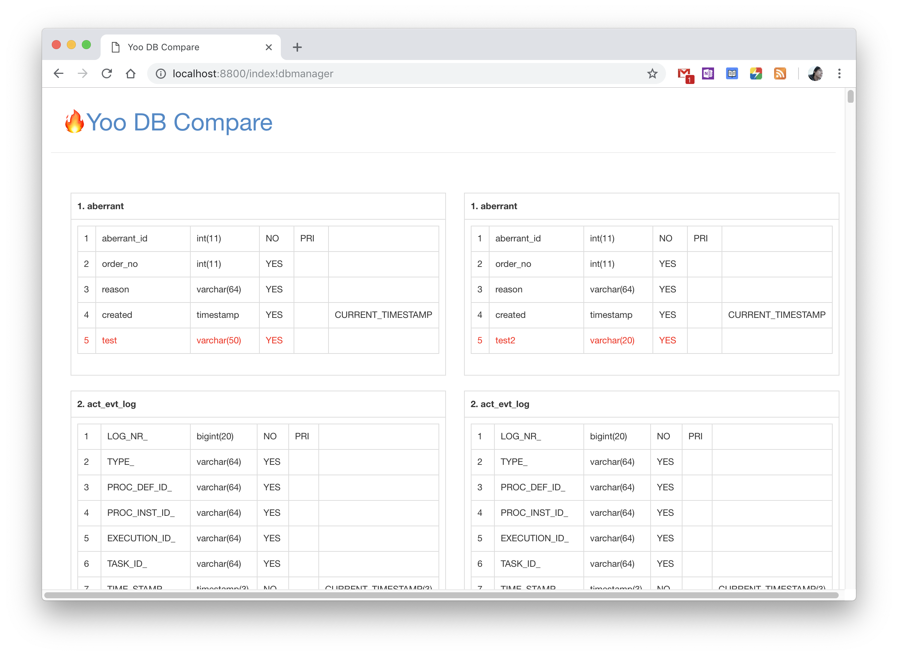

数据库比较工具（YOO-DB-COMPARE）
=============================

WEB应用，目前支持2个mysql数据库比较，差异展示、推荐数据库修改操作支持。

启动：`mvn tomcat7:run`  
访问：<http://localhost:8800/>

**功能截图**

项目地址：<https://github.com/yhui02/yoo-db-compare>
